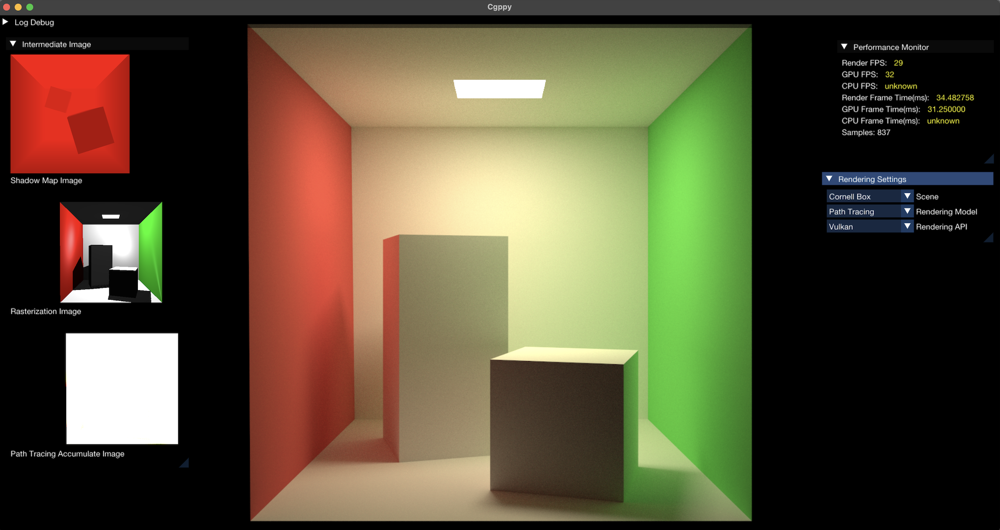

# Cgppy Engine

[](LICENSE.md)

Cgppy is a computer graphics engine. The goal of this engine is to transform various knowledge in the field of computer graphics into engineering code, providing students, researchers, and software developers with an easy-to-use computer graphics tool. This allows for more convenient learning of computer graphics theory, various graphics APIs, and software engineering.




## Cloning
This repository contains submodules for external dependencies and assets, so when doing a fresh clone you need to clone recursively:

```
git clone --recurse-submodules https://github.com/sheldonyancy/Cgppy.git
```

## Graphics API Support

|                  | Windows | Linux | MacOS |
|------------------|---------|-------|-------|
| Vulkan           | YES     | YES   | YES   |
| Metal            | N/A     | N/A   | YES   |
| DirectX 12       | NO      | N/A   | N/A   |
| OpenGL 4.1 - 4.6 | YES     | YES   | YES   |
| CPU              | NO      | NO    | NO    |


## License

This project is licensed under the MIT License.


